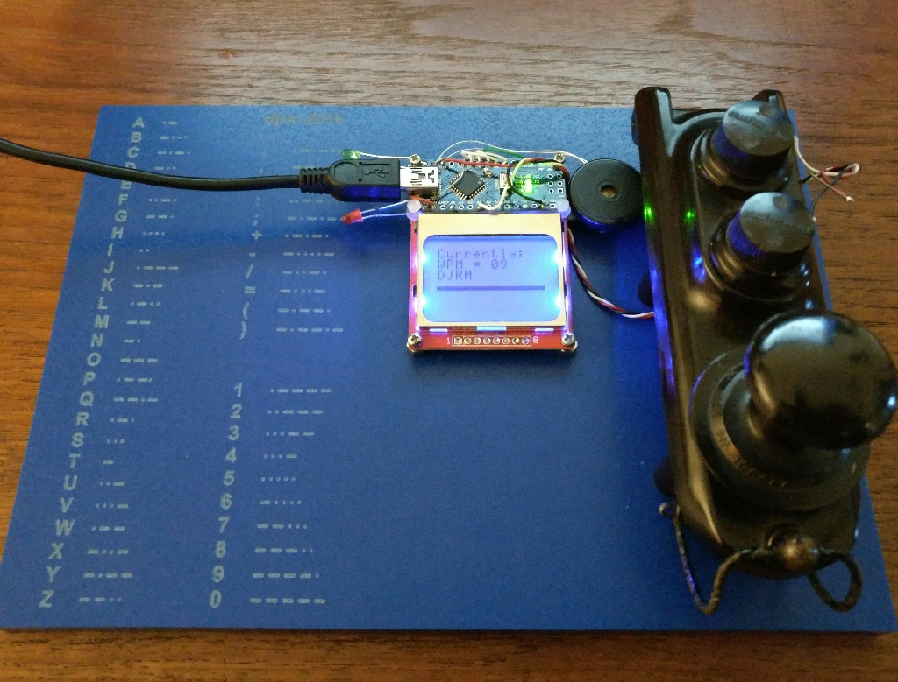

# MagicMorse
Magic Morse decoder Arduino nano with Nokia display

Morse code trainer with laser marked mount in blue EM30 GRP.
I’ve never tried marking this GRP before, the contrast is a little low but quite acceptable for the purpose. The settings used were something like 200mm/s at 10mA. The material is 10mm thick so the focus was way out as I didn’t adjust for that.

## Arduino sketch

[Sketch folder](./Magic_Morse_Nokia8a)

## Wayback Machine link to original sources

[https://create.arduino.cc/projecthub/rayburne/magic-morse-on-arduino-f48633](https://web.archive.org/web/20201019164007/https://create.arduino.cc/projecthub/rayburne/magic-morse-on-arduino-f48633)